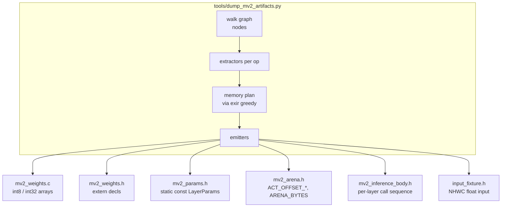
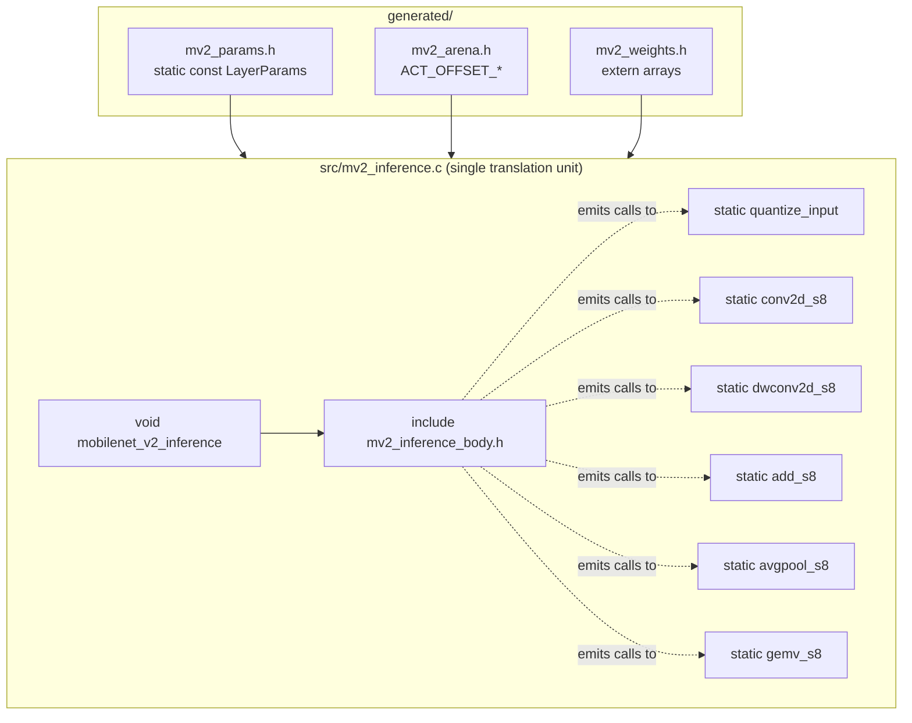
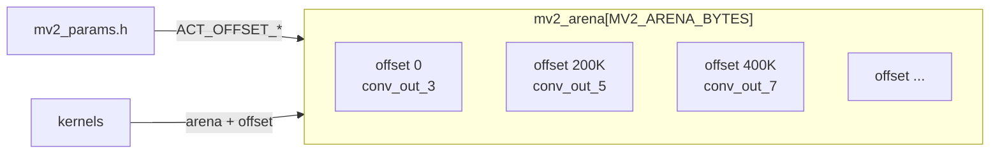
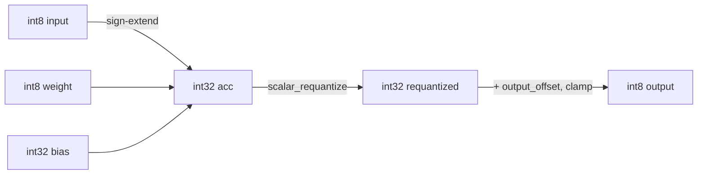
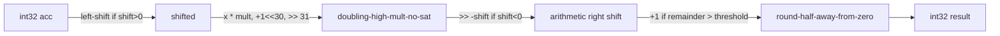
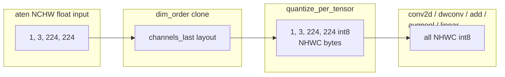
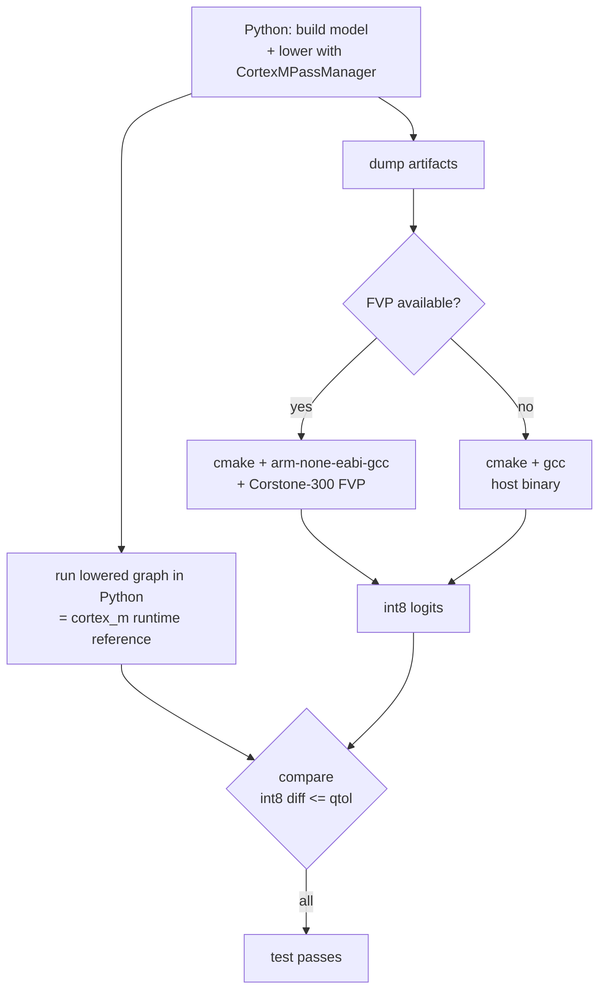
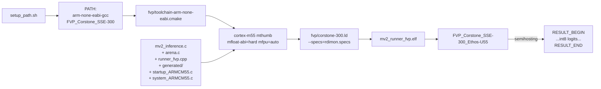

# Standalone MobileNetV2 on Cortex-M55 + Helium — Design

A walkthrough of how the inference path in this directory works:
what the AOT side computes, what the runtime side executes, what the
boundary between them looks like, and how all of it gets verified.

## Why this exists

`backends/cortex_m/ops/operators.py` defines a graph dialect of
quantized operations (`cortex_m::quantized_conv2d`, `quantized_add`,
etc.) and ships C++ kernel wrappers that drive CMSIS-NN.
`test_implementation_mv2()` exercises this end-to-end through the
ExecuTorch C++ runtime: load a `.pte`, build a `Program`/`Method`,
call `method.execute()`.

This project answers a different question: *what does the same model
look like when we strip the runtime away?*  No `Program`.  No
`Method`.  No CMSIS-NN.  Just one C translation unit that compiles
into a function `mobilenet_v2_inference(float*, int8_t*)` and runs
the network on Cortex-M55 + Helium MVE.  The output is bit-exact
with the cortex_m backend's Python reference (the round-half-away
requantize implemented in `passes_utils.py:103`).

Two motivations:

1. **A no-runtime deployment template.**  For tight MCU targets it
   is sometimes easier to ship one C file plus a weight blob than
   to drag in a runtime.  This is the shape of that artifact.
2. **A way to verify the cortex_m kernel math independently of the
   runtime path.**  By generating C that mirrors the math of
   `operators.py` and validating its outputs against the same Python
   reference, we get a second opinion on numerical correctness.

## High-level pipeline


The upper half (model → lowered graph) is reused verbatim from the
existing cortex_m backend.  The lower half (lowered graph → ELF) is
what this project adds: a Python dumper that materializes the
graph as C, plus a hand-written single TU that compiles against it.

## The boundary: what the dumper emits

The contract between AOT and runtime is six files in
`generated/`.  Everything else is hand-written.



| File | Contents |
|---|---|
| `mv2_weights.c` | One `static const int8_t L<i>_<op>_weight[N]` per layer, plus int32 bias and per-channel multiplier/shift arrays |
| `mv2_weights.h` | `extern` declarations of every weight array |
| `mv2_params.h`  | One `static const LayerParams P_L<i>_<op>` per layer — shape, zero-points, multiplier-shift pointers, activation bounds |
| `mv2_arena.h`   | `MV2_ARENA_BYTES`, `MV2_INPUT_NUM_ELEMENTS`, `MV2_OUTPUT_SCALE/ZERO_POINT/NUM_ELEMENTS`, and `ACT_OFFSET_<tensor>` for every planned activation |
| `mv2_inference_body.h` | The body of `mobilenet_v2_inference()` — one C call per layer, with arena offsets and `&P_L<i>_*` as the kernel arguments |
| `input_fixture.h` | Optional `const float mv2_fixture_input[]` for FVP runs that embed the input at build time |

Everything emitted is `static const`, so the linker places it in
flash (or `.rodata` in our Corstone-300 layout, which we route to
DDR — see [Memory layout](#memory-layout)).  Nothing is computed at
runtime that could have been computed offline.

## The translation unit

`src/mv2_inference.c` is a single file with eight `static`
kernel functions above one public entry point:



Why single-TU matters: `-O3` sees both the kernel definition
(`static void conv2d_s8(...) { ... }`) and the call site
(`conv2d_s8(in, out, &P_L1_conv2d);`).  Because `P_L1_conv2d` is
`static const`, the compiler propagates every field as a numeric
literal into the inlined loop body — kernel and call-site
specialization without templating, LTO, or `#define` macros.

Helium intrinsics are gated behind
`__ARM_FEATURE_MVE`; the scalar path remains compileable on x86 for
fast local correctness iteration.

```c
#if defined(__ARM_FEATURE_MVE) && (__ARM_FEATURE_MVE & 1)
#include <arm_mve.h>
#define MV2_USE_MVE 1
#else
#define MV2_USE_MVE 0
#endif
```

## Memory layout (Corstone-300 FVP)

The linker script `fvp/corstone-300.ld` places sections into the
Corstone-300 memory regions like this:

```
+----------+ 0x10000000  +-------------------------+
|  ITCM    | 512 KB     | .text   (code, vectors) |
|   (RX)   |            | .copy.table             |
|          |            | .zero.table             |
+----------+ 0x11000000  +-------------------------+
|  BRAM    | 1 MB        (unused for this binary)
|   (RW)   |
+----------+ 0x30000000  +-------------------------+
|  DTCM    | 512 KB     | .bss    (small statics) |
|   (RW)   |            | .heap                   |
|          |            | .stack  (64 KB top)     |
+----------+ 0x31000000  +-------------------------+
|  SRAM    | 2 MB        (unused)
|   (RW)   |
+----------+ 0x70000000  +---------------------------------+
|  DDR     | 256 MB     | .rodata                          |
|   (RWX)  |            |   weights, biases, multipliers,  |
|          |            |   shifts, LayerParams, fixture   |
|          |            +----------------------------------+
|          |            | .arena_ddr / .bss.tensor_arena   |
|          |            |   uint8_t mv2_arena[~1.5 MB]     |
+----------+            +----------------------------------+
```

DTCM has 512 KB but a typical MV2 build needs `~600` KB of weight
bytes plus a `~1.5` MB activation arena, so we keep `.rodata` and
the arena in DDR.  Code stays in ITCM for fast fetch.  Stack stays
in DTCM for low-latency access from the kernels' inner loops.

The arena holds NHWC `int8_t` activations, with one slot per
producer node assigned by `exir.memory_planning.greedy()` (called
through `MemoryPlanningAlgorithmSuite([greedy])`).  Slot reuse
across non-overlapping lifetimes happens automatically — the same
algorithm `MemoryPlanningPass` uses in `to_executorch()`.



## Kernel set

Every kernel takes `(const int8_t* input, int8_t* output, const
LayerParams* p)` (with `add_s8` taking two inputs).  All kernels do
the same end-to-end shape: int8 input → int32 accumulator → 32-bit
fixed-point requantize → int8 output.



### `quantize_input`

Float NHWC → int8 NHWC.  Per-element `round(x / scale) + zero_point`,
clamped to `[qmin, qmax]`.  Uses
`vcvtaq_s32_f32` (ties-away-from-zero) under MVE, matching
`torch.round` for non-half cases and `roundf` for the host scalar
fallback.

### `conv2d_s8` (35× in full MV2)

Standard NHWC conv with per-channel requantize.  Inner loop
accumulates `sum_kw_kh_ic((x[ih][iw][ic] + input_offset) *
w[oc][kh][kw][ic])` then adds `bias[oc]`.  The MVE path uses
`vmladavaq_s8` (16-lane sum-of-products to scalar int32) on the
input-channel axis when `in_c >= 16`.

### `dwconv2d_s8` (17× in full MV2)

Depthwise NHWC conv with IHWO weight layout (one filter per
channel, `depth_multiplier=1`).  Per-channel requantize.  Same
shape as `conv2d_s8` but the inner loop has no input-channel
reduction — each output channel reads only its matching input
channel.

### `add_s8` (10× in full MV2)

Quantized elementwise add for the inverted-residual skip
connection.  Mirrors `operators.py:168 quantized_add_impl`
bit-exactly: each input is lifted by `SHIFT_INT8 = 20`, requantized
to a shared fixed-point representation, summed, requantized to the
output scale, then clamped and packed to int8.

```
self_fp   = scalar_requantize((self - zp_self) << 20, mult_self, shift_self)
other_fp  = scalar_requantize((other - zp_other) << 20, mult_other, shift_other)
result_fp = self_fp + other_fp
result    = clamp(scalar_requantize(result_fp, mult_out, shift_out) + zp_out)
```

### `avgpool_s8` (1× in full MV2)

`count_include_pad=False` average pool.  Sum int8 inputs (minus
zero_point would change nothing — the scale cancels through
quantize→avg→quantize), divide by the kernel count in float, round
to nearest-even via `nearbyintf` (the platform default
`FE_TONEAREST` matches `torch.round` for ties-to-even).

### `gemv_s8` (1× — the classifier)

The Linear is decomposed by the cortex_m pipeline into
`mm(input, W.T) + sum(input)*filter_offset + kernel_sum` where
`kernel_sum[j] = sum_in_features(W[j]) * input_offset + bias[j]`
(precomputed AOT in `_compute_kernel_sum`).  Our kernel mirrors:

```
input_sum = sum_j(input[j])             // shared across output channels
acc[i]    = sum_j(input[j] * W[i][j])
            + input_sum * filter_offset
            + kernel_sum[i]
out[i]    = clamp(scalar_requantize(acc[i], mult, shift) + output_offset)
```

The MVE path uses `vmladavaq_s8` for both `input_sum` (with a
constant vector of `1`s) and the dot product.

## The requantize helper

This is the single point of numerical correctness.  Every kernel
ends with `scalar_requantize(acc, multiplier, shift)`, which
implements `backends/cortex_m/passes/passes_utils.py:103
requantize_cmsis` bit-exactly:



The non-obvious piece is the rounding mode at the right-shift step.
CMSIS-NN's *scalar* `arm_nn_requantize` rounds ties away from zero;
its *MVE* `arm_requantize_mve` uses `vrshlq_s32` which rounds ties
up.  `requantize_cmsis` matches the scalar version, so we do too:
explicit remainder/threshold compare with a negative-result bump,
not `vrshlq_s32`.  This is why `mve_helpers.h` carries an explicit
`mve_requantize_per_channel` that emulates the scalar rounding via
`vpselq_s32`.

Aside from this rounding choice, the multiplier-and-shift Q31
encoding matches `quantize_multiplier_aot` (passes_utils.py:193): a
signed int32 mantissa in Q31 plus a signed exponent — `frexp(scale)`
with the mantissa scaled by `1<<31`.  We read these straight off
each op's kwargs and emit them verbatim into `mv2_weights.c`.

## NHWC convention

The cortex_m backend operates on channels-last int8 tensors.  In
PyTorch this means shape `(N, C, H, W)` with stride
`(H*W*C, 1, W*C, C)` — bytes are laid out NHWC.



The runner (`runner_fvp.cpp`, `runner_host.c`) feeds the inference
function an NHWC-flattened float buffer.  `quantize_input` reads
floats sequentially and writes int8 sequentially — no transpose
needed at runtime because the test side serializes the input in
NHWC order via `input.permute(0, 2, 3, 1).contiguous()`.

## Verification

Each phase test runs the same compare pipeline:



The reference is the **post-passes Python runtime** — running the
lowered cortex_m graph through PyTorch's eager dispatcher, which
invokes the Python implementations in `operators.py` that use
`requantize_cmsis`.  Our C requantize matches it byte-for-byte,
which is why all four phases pass with `qtol=0` (bit-exact) on the
Corstone-300 FVP.

The four phases are graduated to isolate failure causes:

```
Phase A   TinyLinear(8 -> 4)
          quantize -> gemv -> dequantize
          ---> exercises: scalar_requantize, dumper, arena, FVP toolchain

Phase B   Conv2d -> AvgPool2d -> Linear
          ---> adds: conv2d_s8, avgpool_s8

Phase C   Conv1x1 -> DepthwiseConv -> Conv1x1 -> add
          (one MV2 inverted-residual block)
          ---> adds: dwconv2d_s8, add_s8, residual-hold liveness

Phase D   Full torchvision MobileNetV2
          ---> the real thing
```

A regression in any kernel reveals itself at the smallest phase
that uses that kernel, not at Phase D where the symptom is opaque.

## FVP build & run



`--specs=rdimon.specs` pulls in newlib's semihosting; `printf` and
`exit` go straight to the FVP host.  `cpu0.semihosting-enable=1` on
the FVP command line activates the syscall trap.  The Ethos-U55
NPU is in the binary name (`FVP_Corstone_SSE-300_Ethos-U55`) but
the runner never touches it — we keep `ethosu.num_macs=128` only
because the FVP requires a value.

The `corstone-300.ld` script is a stripped variant of
`examples/arm/arm-scratch/ethos-u/core_platform/targets/corstone-300/platform.ld`
with `.rodata` and the activation arena rerouted to DDR (DTCM is
too small for MV2 weights + arena).

The `startup_ARMCM55.c` and `system_ARMCM55.c` come from
`Cortex_DFP/Device/ARMCM55/Source/` in the same Ethos-U Core
Platform checkout, but no Ethos-U driver code is linked — the
startup file just sets the stack pointer, runs the CMSIS
`SystemInit()` (mostly a no-op on Cortex-M55), and jumps into
`_start` from newlib.

## What this isn't (and follow-ups)

- **The MVE intrinsic kernels are MVE-intrinsic by hand, not by
  CMSIS-NN.**  We don't link CMSIS-NN.  Where CMSIS-NN would do
  something fancy (gather/scatter, predicated loads near tile
  edges, microkernels tuned per channel-count), our kernels stay
  basic.  Performance is not the goal yet — bit-exact correctness
  against the Python reference is.
- **Per-layer kernel specialization is not implemented.**  Every
  layer calls the same generic kernel; the optimizer relies on
  inlining + constant-folding for specialization.  A follow-up
  could template specialized 1×1 conv variants for the hot
  expansion layers (blocks 11/12/16/17 + the head) per the
  reviewer-2 sketch in the original plan.
- **The MV2 entry point is generated, not hand-written.**  The
  earlier plan had the per-layer call sequence as 150 lines of
  hand-written C.  Treating it as data emitted by the dumper
  proved less error-prone and keeps the dumper as the single
  source of truth.  A hand-written variant would be a small
  refactor if it turned out to be useful.
- **No real ImageNet input fixture yet.**  Phase D uses
  `weights=None` (random init) so the test runs offline; with that
  the output is uninformative for top-1.  A follow-up should land
  a pretrained-weights + canonical-image fixture.
- **No FVP cycle counts.**  `examples/arm/executor_runner/arm_perf_monitor.cpp`
  has a clean perf-counter pattern that would slot directly into
  `runner_fvp.cpp` if we want per-layer cycles.

## Quick reference: files

| Concern | File |
|---|---|
| Public API | `include/mv2_inference.h` |
| Kernels + entry point | `src/mv2_inference.c` |
| Bit-exact requantize | `include/mve_helpers.h` |
| Layer-param struct types | `include/mv2_layer_params.h` |
| Activation arena | `src/arena.c` |
| Host harness | `src/runner_host.c` |
| FVP harness | `src/runner_fvp.cpp` |
| Cross-compile | `fvp/toolchain-arm-none-eabi.cmake` |
| Linker script | `fvp/corstone-300.ld` |
| Dumper entrypoint | `tools/dump_mv2_artifacts.py` |
| Per-op extractors | `tools/extractors.py` |
| C array / struct / body emitters | `tools/emitters.py` |
| Phase tests | `backends/cortex_m/test/models/test_mv2_standalone_*.py` |
| FVP build/run helper | `backends/cortex_m/test/models/_mv2_standalone_helpers.py` |
| Reference math | `backends/cortex_m/passes/passes_utils.py:103` `requantize_cmsis` |
| Reference kernels | `backends/cortex_m/ops/operators.py` |
| Sample dumper output | `examples_generated/full_mobilenet_v2/` |
